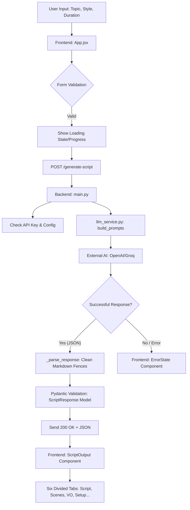

# 🎬 AI Video Script Generator — Project Documentation

## 1. Project Overview
The **AI Video Script Generator** is a full-stack generative AI application designed to streamline the pre-production process for content creators. By leveraging Large Language Models (LLMs) like GPT-4, Llama 3, and Groq, the application transforms a simple topic into a comprehensive, professional-grade production package.

### 🎯 Objectives
- **Automate Scriptwriting:** Reduce the time spent on drafting video content.
- **Provide Visual Context:** Generate scene-by-scene breakdowns with camera angles.
- **SEO & Marketing:** Suggest optimized titles and thumbnail concepts automatically.
- **Workflow Efficiency:** Organize instructions for voiceover, filming, and editing in one place.

---

## 2. Technical Stack

### Frontend Architecture
- **React 19:** Modern component-based UI development.
- **Vite 6:** Rapid build tool and dev server.
- **Lucide React:** Iconography for a professional aesthetic.
- **Vanilla CSS:** Custom design system featuring glassmorphism and smooth animations.

### Backend Infrastructure
- **FastAPI:** High-performance asynchronous Python web framework.
- **Pydantic v2:** Rigorous data validation and JSON serialization.
- **OpenAI/Groq Integration:** Advanced prompt engineering for structured response generation.
- **Uvicorn:** Production-ready ASGI server.

---

## 3. System Architecture

The application follows a **Decoupled Architecture**:

1.  **Client Tier (React):** Handles user interaction, form validation, and state management for the multi-tab display.
2.  **Logic Tier (FastAPI):** Manages API endpoints, handles LLM configuration, and processes prompt templates.
3.  **Intelligence Tier (AI API):** Processes the natural language request and returns structured data.

### 📈 System Flowchart

---

## 4. Feature Breakdown

| Feature | Technical Implementation |
| :--- | :--- |
| **Dynamic Tabs** | State-driven conditional rendering for 6 distinct script views. |
| **Loading Progress** | Step-by-step progress indicator for "Analyzing," "Generating," and "Finalizing." |
| **Response Format** | Forced `json_object` format to ensure programmatic parsing. |
| **Glassmorphism UI** | Uses `backdrop-filter: blur()` and semi-transparent gradients for a premium feel. |
| **Auto-Retry** | Integrated error handling with a one-click "Try Again" mechanism. |

---

## 5. Development Setup

### Prerequisites
- Node.js (v18+)
- Python (3.9+)
- Groq or OpenAI API Key

### Configuration
1.  **Backend:** Create a `.env` file in the `backend/` directory with `OPENAI_API_KEY`.
2.  **Dependencies:**
    - Frontend: `npm install`
    - Backend: `pip install -r requirements.txt`

### Launching the System
- **Backend:** Run `python main.py` or `.\start-backend.bat`.
- **Frontend:** Run `npm run dev` or `.\start-frontend.bat`.

---

## 6. Future Scope
- **Direct Video Generation:** Integration with Sora or Runway API.
- **Multi-Language Support:** Translation of scripts into 10+ languages.
- **Voice Synthesis:** Integrated Text-to-Speech (TTS) using ElevenLabs.

---

## 7. Conclusion
The AI Video Script Generator demonstrates the practical application of generative AI in a full-stack environment. By prioritizing structured data and a high-end user experience, it serves as a robust tool for modern digital creators.

---
**Author:** AI Video Script Generator Team
**Project Type:** College Final Year Project
**Date:** April 2026
